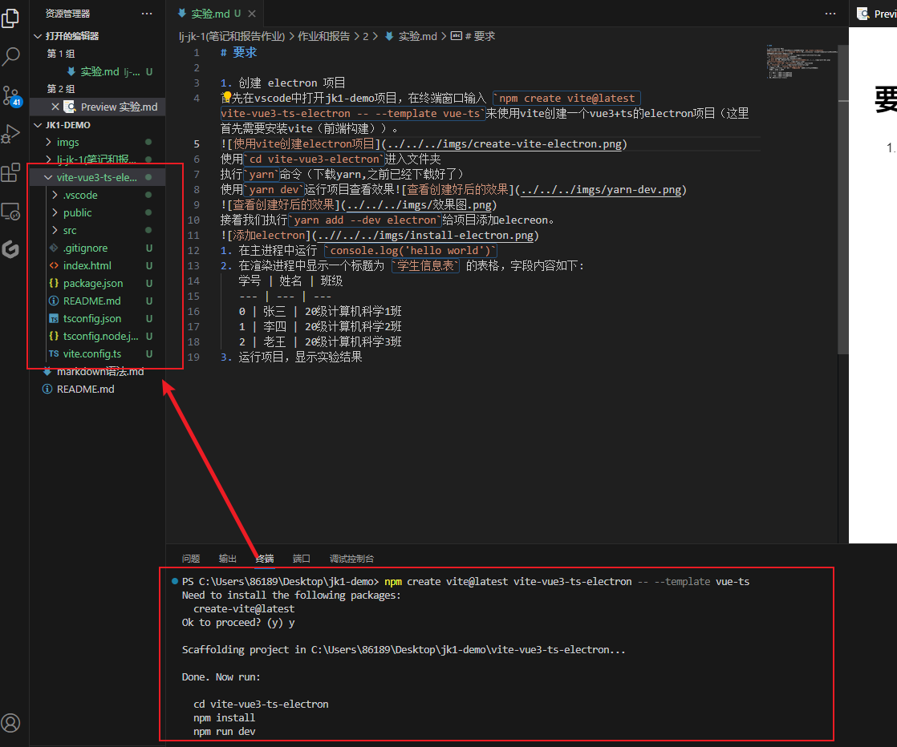
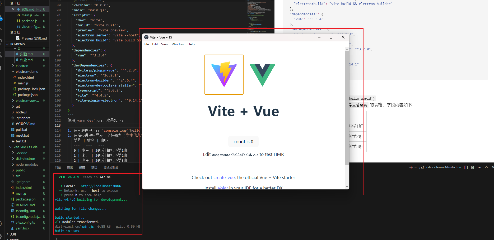
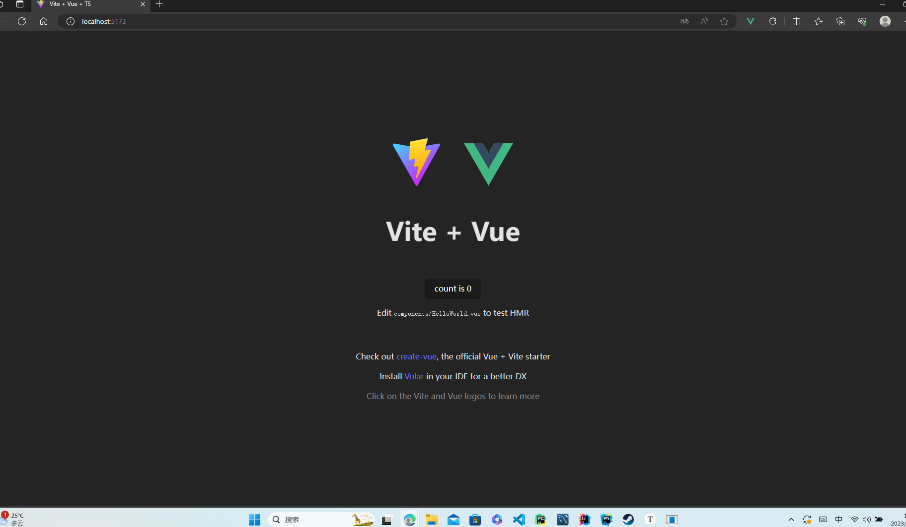
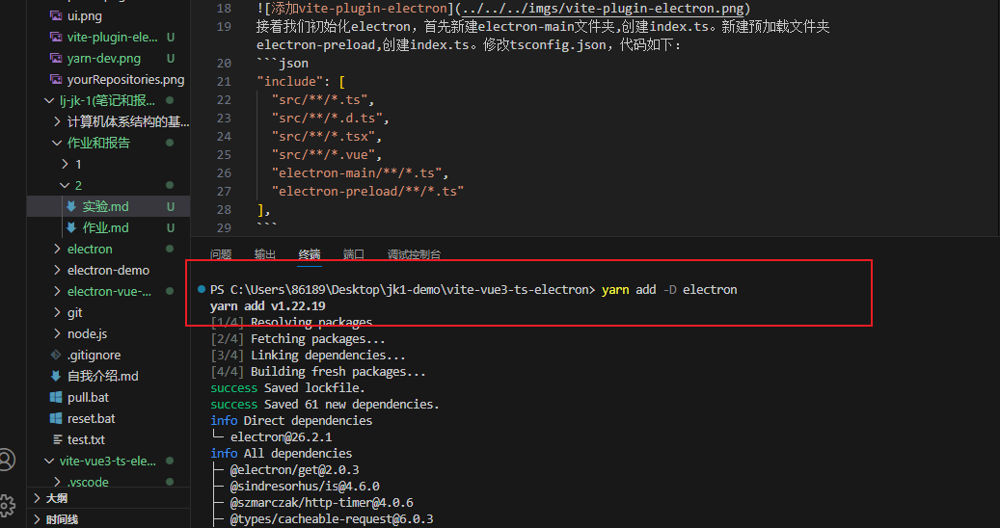
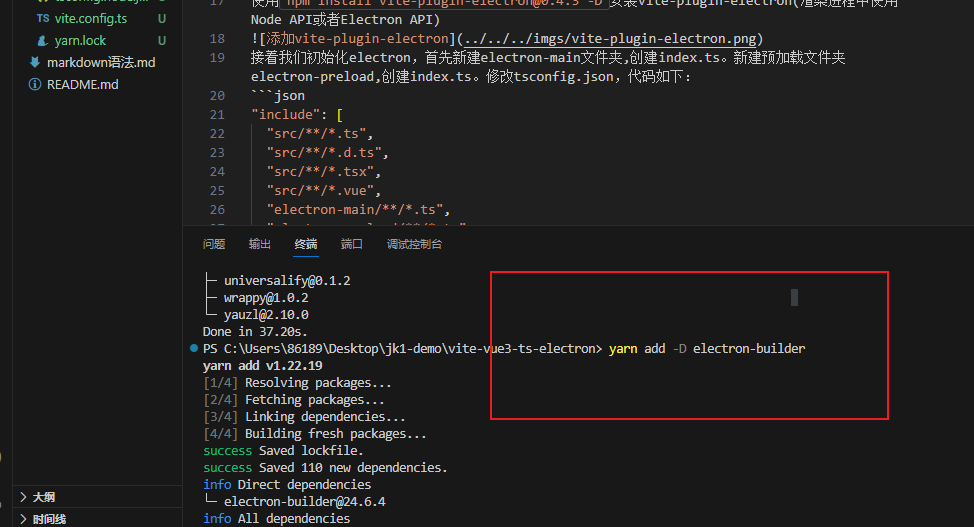
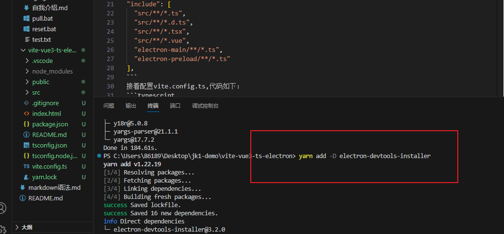
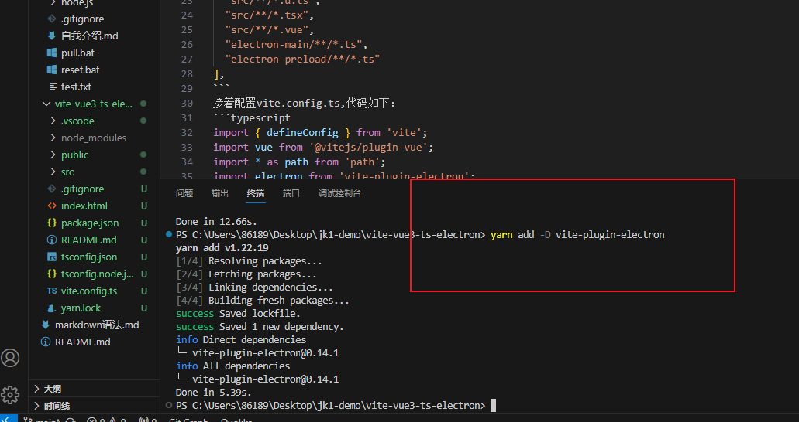
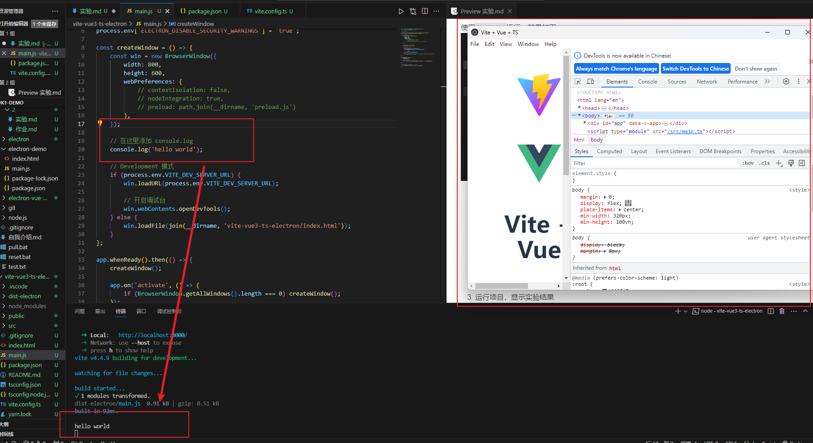
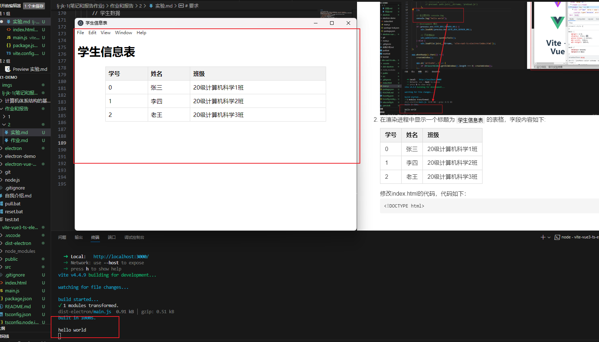

# 要求

## 创建 electron 项目

​	首先在VsCode中打开jk1-demo项目，在终端窗口输入 `npm create vite@latest vite-vue3-ts-electron -- --template vue-ts`来使用vite创建一个vue3+ts的electron项目（这里首先需要安装vite（前端构建））。

使用`cd vite-vue3-ts-electron`进入文件夹。
执行`yarn install`命令（安装依赖）。
使用`yarn dev`运行项目查看效果。





接着我们执行`yarn add -D electron`给项目添加elecreon相关包。



再使用`yarn add -D electron-builder`安装electron-builder(打包)。



使用`yarn add -D electron-devtools-installer`安装electron-devtools-installer(调试和开发)。



使用`yarn add -D vite-plugin-electron`安装vite-plugin-electron(渲染进程中使用Node API或者Electron API)。



接着我们初始化electron，新建main.js。(ts的ES语法不太会用)代码如下：

```javascript
const { app, BrowserWindow } = require('electron');
const { join } = require('path');

// 屏蔽安全警告
// Electron Security Warning (Insecure Content-Security-Policy)
process.env['ELECTRON_DISABLE_SECURITY_WARNINGS'] = 'true';

const createWindow = () => {
    const win = new BrowserWindow({
        width: 800,
        height: 600,
        webPreferences: {
            // contextIsolation: false,
            // nodeIntegration: true,
            // preload: path.join(__dirname, 'preload.js')
        },
    });


    // Development 模式
    if (process.env.VITE_DEV_SERVER_URL) {
        win.loadURL(process.env.VITE_DEV_SERVER_URL);

        // 开启调试台
        win.webContents.openDevTools();
    } else {
        win.loadFile(join(__dirname, 'vite-vue3-ts-electron/index.html'));
    }
};

app.whenReady().then(() => {
    createWindow();

    app.on('activate', () => {
        if (BrowserWindow.getAllWindows().length === 0) createWindow();
    });
});

app.on('window-all-closed', () => {
    if (process.platform !== 'darwin') app.quit();
});
```


接着配置vite.config.ts,代码如下：

```typescript
import { defineConfig } from 'vite';
import vue from '@vitejs/plugin-vue';
import electron from 'vite-plugin-electron';

// https://vitejs.dev/config/
export default defineConfig({
    plugins: [
        vue(),
        electron({
            // 主进程入口文件
            entry: 'main.js',
        }),
    ],
    server: {
        // 端口
        port: 3000,
    },
});
```

​		修改package.json，代码如下：

```json
{
  "name": "vite-vue3-ts-electron",
  "private": true,
  "version": "0.0.0",
  "main": "main.js",
  "scripts": {
    "dev": "vite",
    "build": "vite build",
    "preview": "vite preview",
    "electron:serve": "vite --host",
    "electron:build": "vite build && electron-builder"
  },
  "dependencies": {
    "vue": "^3.3.4"
  },
  "devDependencies": {
    "@vitejs/plugin-vue": "^4.2.3",
    "electron": "^26.2.1",
    "electron-builder": "^24.6.4",
    "electron-devtools-installer": "^3.2.0",
    "typescript": "^5.0.2",
    "vite": "^4.4.5",
    "vite-plugin-electron": "^0.14.1"
  }
}
```


​使用`yarn dev`运行，效果如下：


## 在主进程中运行 console.log('hello world')

在main.js中添加上述代码即可，运行结果如图所示：


## 在渲染进程中显示一个标题为 学生信息表的表格，字段内容如下:

学号 | 姓名 | 班级
--- | --- | ---
0 | 张三 | 20级计算机科学1班
1 | 李四 | 20级计算机科学2班
2 | 老王 | 20级计算机科学3班

修改index.html的代码，代码如下：

```html
<!DOCTYPE html>
<html lang="en">
<head>
    <meta charset="UTF-8">
    <meta name="viewport" content="width=device-width, initial-scale=1.0">
    <title>学生信息表</title>
    <style>
        table {
            border-collapse: collapse;
            width: 80%;
            margin: 20px auto;
        }

        th, td {
            border: 1px solid #ddd;
            padding: 8px;
            text-align: left;
        }

        th {
            background-color: #f2f2f2;
        }
    </style>
</head>
<body>
    <h1>学生信息表</h1>
    <table>
        <thead>
            <tr>
                <th>学号</th>
                <th>姓名</th>
                <th>班级</th>
            </tr>
        </thead>
        <tbody id="student-table-body">
            <!-- 表格内容将在 JavaScript 中动态生成 -->
        </tbody>
    </table>
    
    <script>
      // 获取表格的 tbody 元素
      const tableBody = document.getElementById('student-table-body');

      // 学生数据
      const students = [
        { 学号: 0, 姓名: '张三', 班级: '20级计算机科学1班' },
        { 学号: 1, 姓名: '李四', 班级: '20级计算机科学2班' },
        { 学号: 2, 姓名: '老王', 班级: '20级计算机科学3班' }
      ];

      // 循环遍历学生数据，将每个学生的信息添加到表格中
      students.forEach((student) => {
      const row = document.createElement('tr');
      row.innerHTML = `
        <td>${student.学号}</td>
        <td>${student.姓名}</td>
        <td>${student.班级}</td>
      `;
      tableBody.appendChild(row);
      });

    </script>
</body>
</html>
```

## 运行项目，显示实验结果




