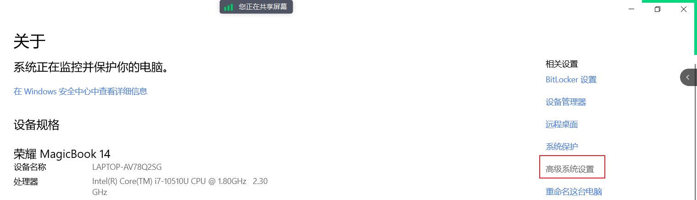
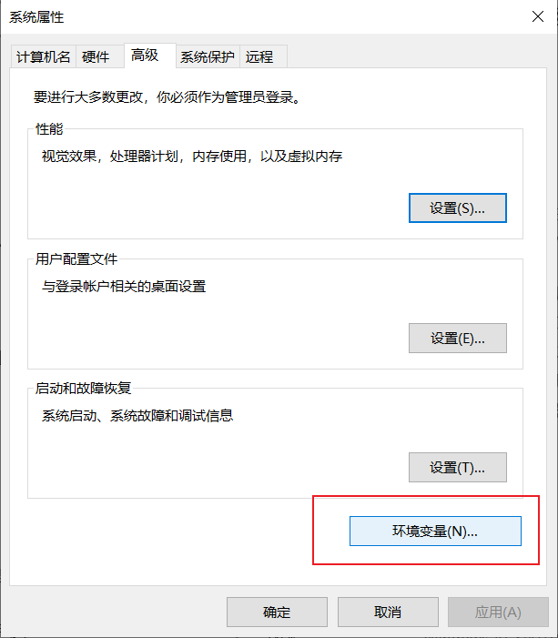
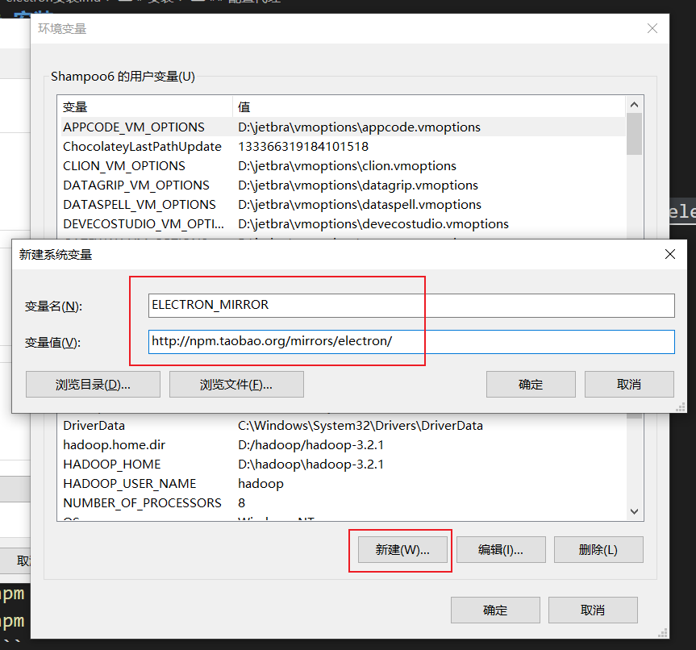

# 安装

## 配置代理

添加环境变量

```
npm config set ELECTRON_MIRROR http://npm.taobao.org/mirrors/electron/
```

若 npm 版本过高导致无法设置上述环境变量则需自行设置系统环境变量







然后重启电脑生效

## 运行命令

```shell
npm init -y
npm install --save-dev electron
```

## 创建 electron 项目流程

- 创建项目目录 `electron-demo`
- 初始化项目并安装 `electron`
  ```shell
  npm init -y
  npm install --save-dev electron
  ```
- 创建程序入口 `main.js`
- 修改 `package.json` 中的 `main` 属性
- 创建程序主界面 `index.html`
- 修改 `package.json` 中的 `scripts`: `"dev": "electron ."`
- 运行 `npm run dev`