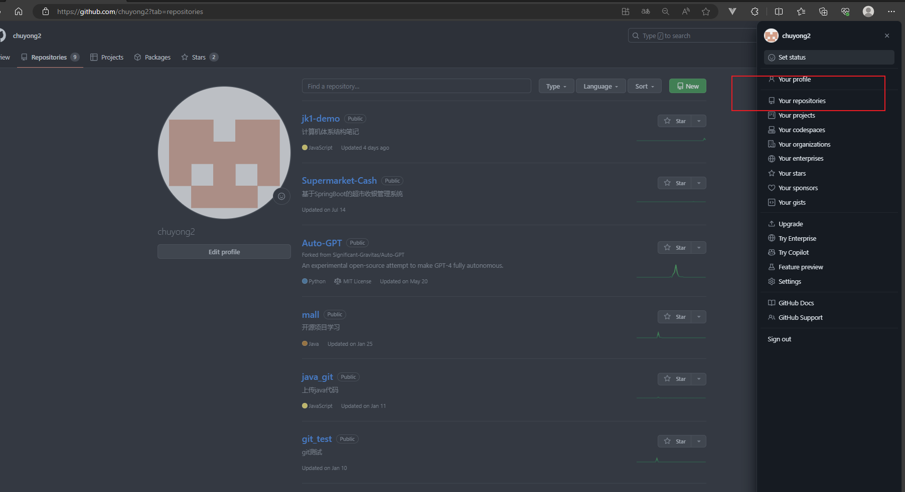
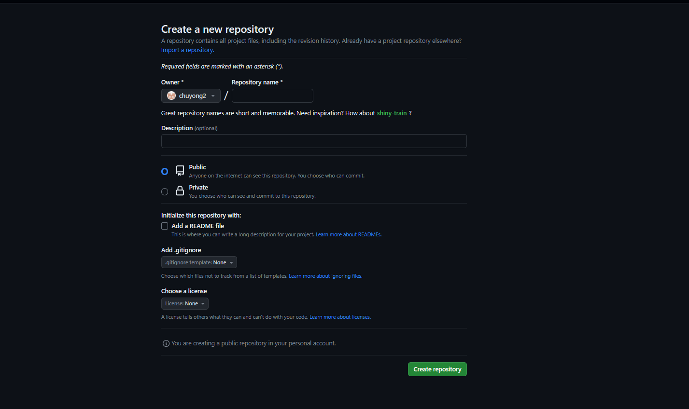
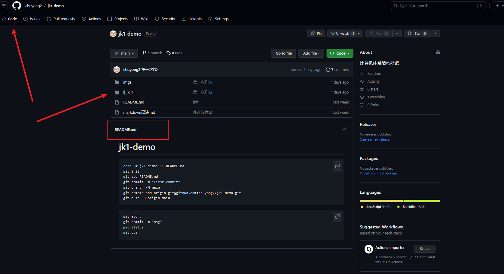
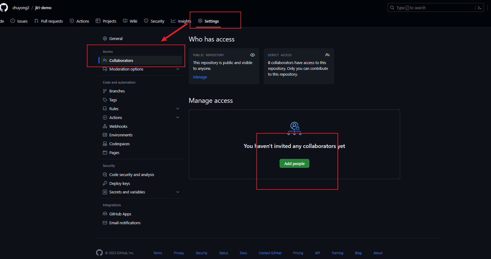
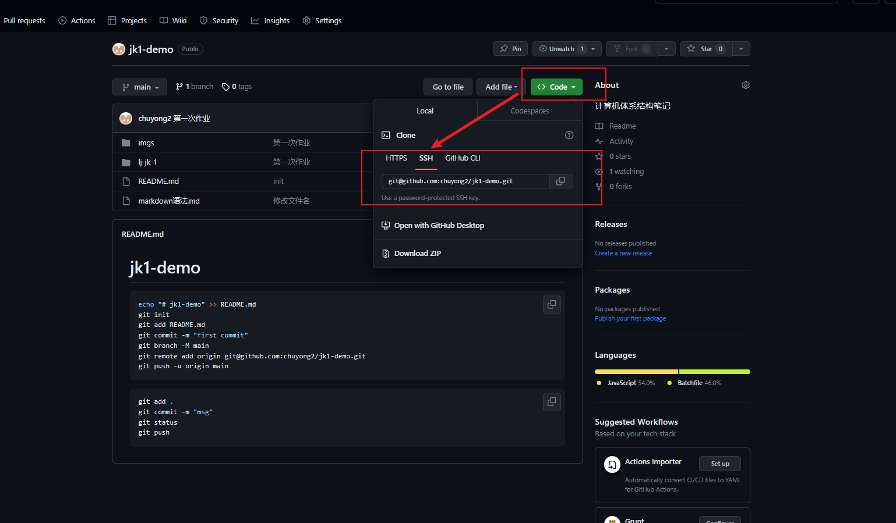
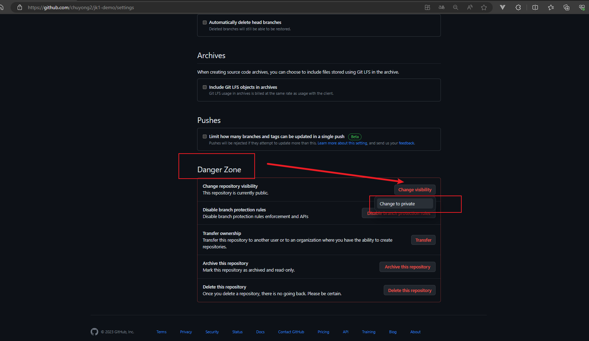
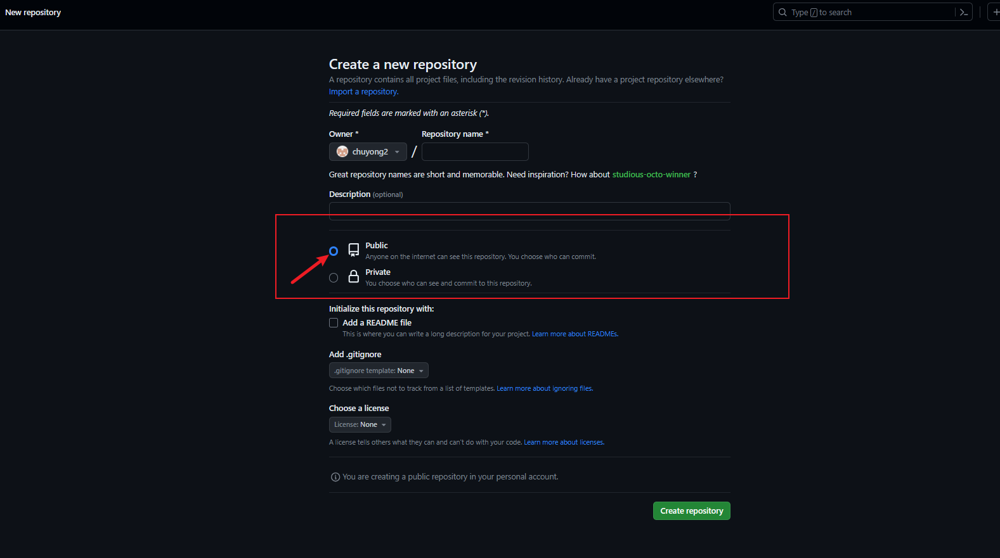

# 要求

1. 创建git本地仓库

   - 先在本地创建项目文件夹jk1-demo。
   
   - 给项目添加一个README方便描述项目的内容。
   
   - 在创建的文件夹下打开Git Bash。
   
   - 执行以下命令即可。
   
     ```shell
     echo "# jk1-demo" >> README.md  # 给README.md添加一级标题jk1-demo
     git init  # 初始化
     git add README.md 
     git commit -m "first commit" 
     ```
   
2. 创建git远程仓库

   - 以GitHub为例，登陆后点击如下界面：

     

   - 点击New创建仓库：

     

   - 执行以下命令：

     ```shell
     git branch -M main
     git remote add origin git@github.com:chuyong2/jk1-demo.git
     git push -u origin main
     ```

     进入Code界面就可以看到初始化后的后的仓库了（这里已经提交过几次代码）：

     

3. 添加开发者

   - 进入刚刚创建的仓库中，点击Settings可以看到如下界面：

     

   - 在此界面就可以添加开发者

4. 克隆仓库到本地

   - 以我的GitHub仓库为例，进入仓库后查看SSH地址：

     

     然后打开Git Bash，即可执行以下命令完成克隆：

     ```shell
     git clone git@github.com:chuyong2/jk1-demo.git
     ```

5. 添加资料到本地仓库

   - ​	先将需要上传的资料放进已经初始化的仓库中，然后执行`git add .`将他们添加到git仓库的暂存区，然后执行`git status`查看已经添加到暂存区的文件列表以及它们的状态，然后执行`git commit -m "改动的信息或提示"`将他们添加到本地仓库。

6. 提交数据

   - 例如本次笔记的修改，在vscode中打开jk1-demo文件夹，然后新建终端，即可执行如下命令：

     ```shell
     git add .
     git commit -m "改动的信息或提示"
     ```

7. 推送数据

   - 同样的，执行过`git push -u origin main`后可以直接在终端中执行如下命令：

     ```shell
     git push
     ```

8. 拉取数据

   - 在终端中直接执行如下命令：

     ```shell
     git pull
     ```

9. 项目开源

   - 打开创建的仓库，在Settings中找到Danger Zone后点击Change visibility（这里我在创建项目时就公开了）：

     

     将仓库改为public即可。

     也可以在创建的时候直接设置为public，如下图所示。

     


