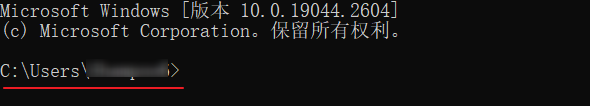
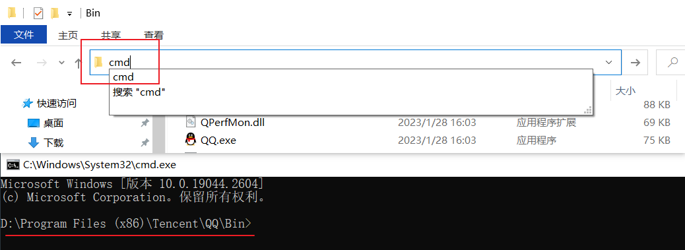
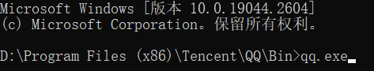

# cwd（command working directory）命令工作目录

打开任意命令行工具，如: cmd、powershell、gitbash、bash、sh 等，都会显示一个路径，例如:

此路径就是 `cwd`

## 什么是 cwd?

cwd 是程序运行的一个基本目录。例如: 运行电脑上的 qq.exe 程序，那么我们可以这样做，先跳转到 qq.exe 所在的目录，如图:

然后在资源管理器 url 栏上输入 cmd 并回车

此时你将打开 cmd 终端，并看到 cwd 的路径正好就是 qq.exe 所在目录

然后在 cmd 中输入 qq.exe (或者只输入 qq 也可以)，然后回车

这样就能运行 qq.exe 这个程序了

所以 qq.exe 作为命令或程序运行时，前面的那个路径，就是我们说的 cwd

## 切换路径和盘符

使用 `cd` 命令切换目录

其中 `./` 代表当前目录

`../` 代表上级目录

使用 `d:` `c:` 或 `e:` 切换盘符为 D盘 C盘 E盘

使用 `dir` 命令查看当前目录下的目录和文件