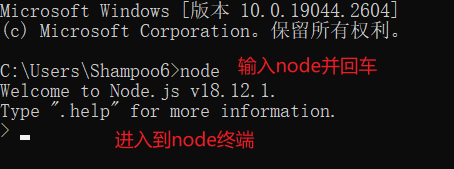
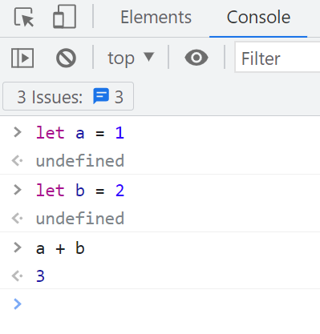
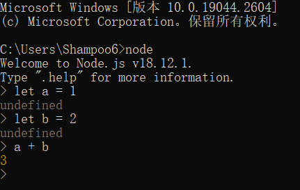
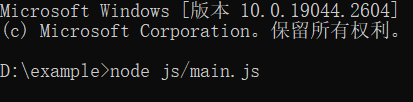

# 运行node.js

## 运行终端

因为 `node.js` 在安装时将 `node.exe` 所在目录添加到了环境变量中，所以在任意 `cwd` 下都能直接运行 `node` 命令，例如:



在 `node.js` 终端中，类似于浏览器的终端，例如: 





## 运行脚本

例如，此处的 cwd 为: `D:/example`

我们创建 `js` 文件: `D:/example/js/main.js`

```js
// main.js
console.log('hello world')
```

若要运行 `main.js` 则需要运行命令如图:



参数的路径是一个基于 cwd 的相对路径